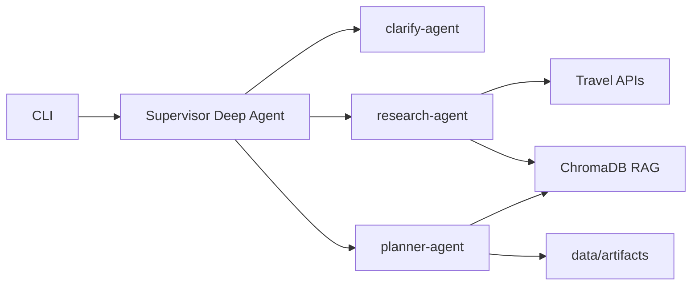

# TripForge

Консольный ассистент для планирования поездок: из свободного описания запроса собирает черновик параметров, подтягивает факты из открытых API, строит маршруты по городу и сохраняет итоговый маршрут с бюджетом.

## Возможности

- **Уточнение запроса** — извлечение полей поездки (направление, даты, бюджет, интересы, транспорт в городе и т.д.) и диалог при нехватке данных.
- **Исследование** — геокодирование (Nominatim), достопримечательности (OpenTripMap), погода (Open-Meteo), отели, маршруты между точками (OpenRouteService).
- **Планирование** — поиск по индексированным фактам в ChromaDB и сохранение артефактов сессии.
- **Human-in-the-loop** — перед вызовами внешних API и сохранением файлов CLI запрашивает approve / edit / reject (и respond для отклонения).

## Архитектура



| Компонент | Назначение |
|-----------|------------|
| `src/agents/factory.py` | Сборка агента и субагентов (Deep Agents + LangGraph) |
| `src/tools/clarify.py` | `extract_trip_draft` |
| `src/tools/research.py` | Геокод, места, маршруты, погода, отели, индексация |
| `src/tools/planner.py` | Поиск фактов, `save_artifacts` |
| `src/graphs/route_planning.py` | Детерминированный граф маршрутизации |
| `src/rag/store.py` | ChromaDB по `session_id` |
| `src/clients/travel_api.py` | HTTP-клиент к внешним сервисам |

## Требования

- Python **3.12+**
- [Ollama](https://ollama.com/) с моделями чата и эмбеддингов (по умолчанию `qwen3:32b` и `nomic-embed-text`)
- [uv](https://docs.astral.sh/uv/) (рекомендуется) или другой менеджер зависимостей

Опционально:

- ключ [OpenTripMap](https://opentripmap.io/docs) — больше и стабильнее данные по местам;
- ключ [OpenRouteService](https://openrouteservice.org/) — расстояния и время между точками;
- [Langfuse](https://langfuse.com/) — трейсы вызовов LLM и инструментов.

## Установка

```bash
git clone <repository-url>
cd TripForgePet
uv sync
cp .env.example .env
# отредактируйте .env при необходимости
```

Убедитесь, что Ollama запущена и модели скачаны:

```bash
ollama pull qwen3.6:35b
ollama pull nomic-embed-text
```

## Конфигурация

Переменные окружения с префиксом `TRIPFORGE_` (файл `.env`):

| Переменная | Описание | По умолчанию |
|------------|----------|--------------|
| `TRIPFORGE_OLLAMA_BASE_URL` | URL Ollama | `http://localhost:11434` |
| `TRIPFORGE_OLLAMA_MODEL` | Модель чата | `qwen3.6:35b` |
| `TRIPFORGE_OLLAMA_EMBED_MODEL` | Модель эмбеддингов | `nomic-embed-text` |
| `TRIPFORGE_OPENTRIPMAP_API_KEY` | OpenTripMap | — |
| `TRIPFORGE_OPENROUTESERVICE_API_KEY` | OpenRouteService | — |
| `TRIPFORGE_REQUEST_TIMEOUT_SECONDS` | Таймаут HTTP | `60` |
| `TRIPFORGE_MAX_PLACES` | Лимит POI | `12` в `.env.example`, `10` в коде |
| `TRIPFORGE_LANGFUSE_*` | Ключи и URL Langfuse | опционально |

Каталоги данных (создаются автоматически): `./data/chroma`, `./data/artifacts`.

## Запуск

```bash
uv run python main.py
```

Введите описание поездки на русском или английском, например: «Выходные в Праге, пешком, музеи и еда, бюджет 500 EUR».

При прерываниях (interrupt) выберите решение для инструмента:

- `approve` — выполнить как предложено;
- `edit` — изменить JSON аргументов;
- `reject` — отменить с причиной.

После успешного `save_artifacts` в `./data/artifacts/<session_id>/` появятся:

- `meta.json` — черновик поездки и метаданные сессии;
- `itinerary.md` — маршрут в Markdown;
- `budget.json` — строки бюджета и итог.

## Разработка

```bash
uv run ruff check .
uv run ruff format .
```
